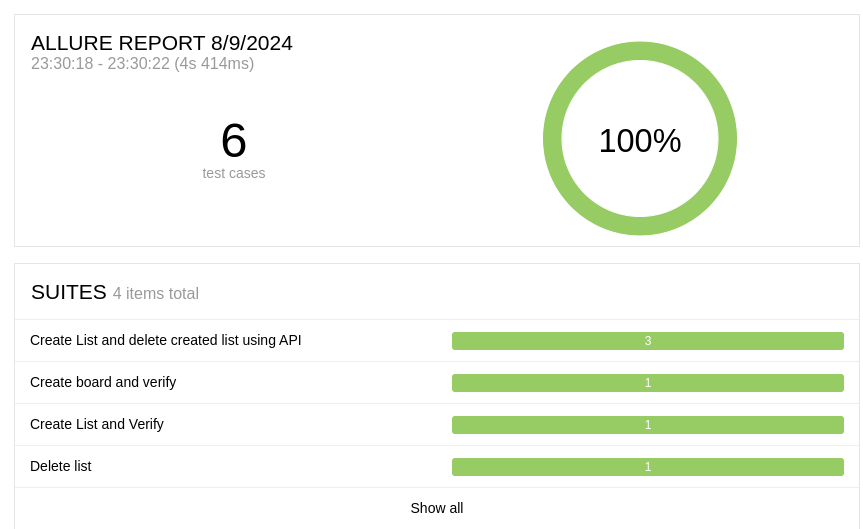

# QA Automation task for TransMedia Inc.

This project covers an End-to-end(e2e) automation task for TransMedia Inc. We have used a single framework to automate both Web and API tasks. Please read below for installation and usage guidelines 

## Table of Contents

- [Project Title](#project-title)
  - [Table of Contents](#table-of-contents)
  - [Features](#features)
  - [Installation](#installation)
  - [Usage](#usage)
  - [Contributing](#contributing)
  - [License](#license)
  - [Contact](#contact)

## Features
* Clean code principles followed
* Used Page Object Model to avoid redundant work and hard coding
* Single framework used for both Web and API automation
* Single command run
* Reporting tool integrated for better visualization of test result

## Installation
1. Clone the repo:
   ```sh
   https://github.com/Ekanto/transmedia_qa-automation-home-assignment.git

2. Navigate to the project directory:
   ```sh
   cd transmedia_qa-automation-home-assignment

3. Now run `npm install` to install the node dev dependencies 

## Usage
In the project root directory - 

**Using the browser -** 
- Type `npx cypress open`
- Select E2E testing
- Select Chrome or Firefox
- Now run the `run_all.cy.js` spec file to run all the tests
- It should execute all the tests including Web and API
  
**Using the command line -**
- Type `npm run e2e-regression`
- It will run all the tests in the command line
- You should be able to see the following information when all the tests are successfully passed


**Using the command line with test report -**

This project includes a reporting tool **Allure Report** which helps visualize the test result better. To run all the tests generating a report - 
- Type `npm run e2e-regression-allure`
- It should run all the tests as before but it will generate some results in the `./allure-results` folder
- After completion of this command, now run `npm run e2e-regression-allure-report`
- It will invoke a browser and you should see all the tests result in your browser better!



   


